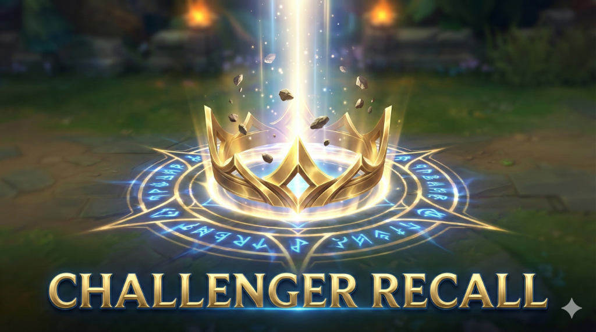

# 🏆 Ultimate Challenger Recall

**Changer ton recall pour l'animation Challenger exclusive**


---

## 📋 Description

Ce mod remplace ton animation de recall par **l'animation Challenger gold** exclusive, normalement réservée aux joueurs classés Challenger.

### ✨ Caractéristiques

- 🏆 Animation Challenger gold professionnelle
- ✨ Particules et effets visuels premium
- 🎯 Fonctionne sur toutes les cartes (SR, ARAM, BRAWL)
- ✅ Compatible avec le mod "No Honor Recall"

---

## 🎨 Aperçu


*Animation de recall Challenger en jeu*


*Badge Challenger*

---

## 🚀 Installation

### Prérequis

- **Celestial Launcher**
- League of Legends

### Étapes

1. **Ouvre Celestial Launcher**
2. **Glisse-dépose** `UltimateChallengerRecall.fantome`
3. **Active** le mod
4. **Lance** le jeu

### Utilisation avec No Honor Recall

Pour désactiver Honor ET avoir Challenger:

1. Charge **les deux mods**:
   - `UltimateChallengerRecall.fantome`
   - `No_Honor_Recall_FINAL.fantome`
2. Active les deux
3. Lance le jeu

**Résultat:**
- 🏆 Ton recall = Animation Challenger
- 🔵 Honor 5 = Désactivé (bleu par défaut)

---

## 🔧 Contenu du Mod

```
UltimateChallengerRecall.fantome
└── Contains:
    ├── META/info.json
    ├── WAD/DATA.wad.client
    └── WAD/DATA.wad.client
```

---

## 📝 Notes

- Ce mod est **cosmétique uniquement**
- N'affecte pas ton classement réel
- Visible uniquement pour toi (client-side)

---

## 📜 Crédits

- **Créé par:** Theop
- **Assistance:** Antigravity AI
- **Assets:** Riot Games

---

**Profite de ton recall Challenger! 🏆**
