# 🏆 Challenger Recall - League of Legends Mod


**Replace your recall animation with the exclusive Challenger gold recall - no rank required!**

---

## 📖 Overview

This mod pack contains **two League of Legends cosmetic mods** that work together to give you the ultimate Challenger recall experience:

1. **🏆 Challenger Recall** - Replaces your recall animation with the prestigious Challenger gold effect
2. **🚫 No Honor Recall** - Disables Honor 5 orange/purple VFX overlay (so Challenger effect shows properly)

Both mods are **client-side only** and won't affect your actual rank or honor level.

---

## 🎨 Preview

<div align="center">


*In-game Challenger recall animation*


*Challenger tier badge*

</div>

---

## 📦 What's Included

```
📁 .FANTOME - Chall Recall Only Pack/
├── 🏆 Challenger_Recall/
│   ├── Challenger_Recall.fantome        [Ready to install]
│   ├── README.md                        [Detailed guide]
│   ├── Recall_Preview.png
│   └── Season_2023_-_Challenger.png
└── 🚫 No Honor_Recall/
    ├── No Honor Recall.fantome          [Ready to install]
    └── No Honor Recall.png

📁 WAD&META - Chall Recall Only Pack/    [Developer files]
├── Challenger_Recall/
│   └── WAD/DATA.wad.client              [Recall animations]
└── No Honor Recall/
    └── WAD/Global.wad.client            [Honor VFX disable]
```

---

## 🚀 Installation

### Prerequisites
- **[Celestial Launcher](https://github.com/LeagueToolkit/cslol-manager)** (or compatible mod manager)
- League of Legends installed

### Steps

1. **Download this repository**
   ```bash
   git clone https://github.com/TheoPerson/Challenger-Recall.git
   ```
   Or use GitHub's **Code → Download ZIP**

2. **Open Celestial Launcher**

3. **Drag and drop BOTH `.fantome` files**:
   - `.FANTOME - Chall Recall Only Pack/Challenger_Recall/Challenger_Recall.fantome`
   - `.FANTOME - Chall Recall Only Pack/No Honor_Recall/No Honor Recall.fantome`

4. **Enable both mods** in Celestial

5. **Launch League of Legends**

6. **Enjoy your Challenger recall!** 🏆

---

## ⚙️ How It Works

```mermaid
graph LR
    A[League of Legends] -->|Loads| B[Celestial Launcher]
    B -->|Mod 1| C[Challenger Recall]
    B -->|Mod 2| D[No Honor Recall]
    C -->|Override| E[Recall Animation]
    D -->|Override| F[Honor VFX]
    E --> G[⭐ Challenger Gold Effect]
    F --> H[🔵 Default Blue Recall]
```



- **Challenger Recall**: Patches `DATA.wad.client` to replace recall animations
- **No Honor Recall**: Patches `Global.wad.client` to disable Honor 5 orange/purple overlay
- **Combined Result**: Pure Challenger gold recall without Honor interference

---

## ❓ FAQ

### Do I need both mods?
- **If you're NOT Honor 5**: Install only `Challenger_Recall.fantome`
- **If you ARE Honor 5**: Install BOTH mods (Honor VFX overrides Challenger otherwise)

### Will this affect my rank?
**No.** This is purely cosmetic and client-side only. Nobody else can see it.

### Is this bannable?
Custom cosmetic mods are generally low-risk, but use at your own discretion. Riot's stance on client-side modifications is unclear. **We take no responsibility for any consequences.**

### Does it work on all maps?
**Yes.** Works on Summoner's Rift, ARAM, Arena, and other modes.

---

## 🛠️ Technical Details

| Component | File | Size | Purpose |
|-----------|------|------|---------|
| Challenger Recall | `DATA.wad.client` | 1.07 MB | Recall animations/VFX |
| No Honor Recall | `Global.wad.client` | 2.32 MB | Honor system override |

**Tested on**: League of Legends Patch **15.24.1**

---

## 📝 Credits

- **Created by**: [TheoPerson](https://github.com/TheoPerson)
- **AI Assistant**: Antigravity
- **Game Assets**: Riot Games
- **Inspired by**: League of Legends competitive scene

---

## 📜 Legal

This project is **not affiliated with, endorsed by, or in any way officially connected with Riot Games**.

League of Legends and all related logos, characters, and assets are trademarks or registered trademarks of Riot Games, Inc.

**Use at your own risk.** The creators are not responsible for any bans or penalties resulting from mod usage.

---

## 🌟 Support

If you enjoy this mod:
- ⭐ **Star this repository**
- 🐛 **Report issues** in the Issues tab
- 🔀 **Fork and improve**

---

<div align="center">

**Enjoy your Challenger recall!** 🏆✨

</div>
